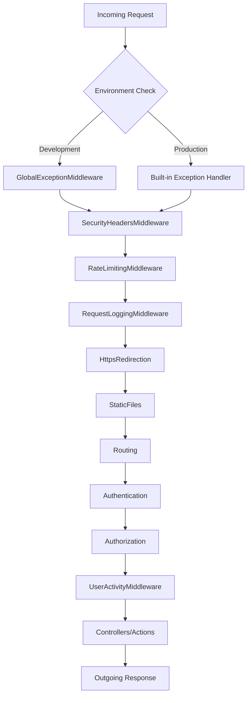

# 📚 E-Commerce Website for Books

An ASP.NET Core MVC-based e-commerce platform made using the [Repository Design Pattern](https://medium.com/@vijaymalviya320/repository-design-pattern-c24c709dd409) designed for selling books online. It features role-based access, admin management tools, user-friendly book listings, and a responsive modern UI.

## 🚀 Features

### 🛒 Customer Side
- Browse books by category or author
- Search functionality
- View detailed book information
- Add books to cart
- Cart persistence with history tracking after checkout
- Separate active cart vs. past orders
- Place orders
- Real Time notifications using SignalR
- KPI's in Order History

### 🛠️ Admin Panel
- Dashboard with sidebar navigation
- Add/Edit/Delete books
- Manage categories and authors
- View user orders
- Manage Orders
- Filter/search functionality in listings

### 🔐 Authentication
- User registration and login
- Role-based access: `Admin` and `User`
- Access control to prevent unauthorized page access
- Custom `AccessDenied` view for blocked routes

### 🖥️⇆🖥️ Middleware

Custom middleware components are integrated into the request pipeline to enhance **security**, **logging**, and **user experience**.

#### 1. GlobalExceptionMiddleware (Development Only)
- **Environment:** Active only in Development  
- **Purpose:** Centralized error handling with detailed stack traces for debugging  
- **Features:** Captures unhandled exceptions and returns structured error responses with development-specific details  

#### 2. SecurityHeadersMiddleware
- **Purpose:** Adds critical security headers to all responses  
- **Headers Applied:**
  - `X-Frame-Options: DENY` → prevents clickjacking  
  - `X-XSS-Protection: 1; mode=block` → enables XSS filtering  
  - `X-Content-Type-Options: nosniff` → prevents MIME sniffing  
  - `Referrer-Policy: strict-origin-when-cross-origin`  
  - `Content-Security-Policy` → controls resource loading  
  - `Strict-Transport-Security` → enforces HTTPS (when using HTTPS)  

#### 3. RateLimitingMiddleware
- **Purpose:** Throttles requests to prevent abuse and DoS attacks  
- **Limits:**
  - `Login/SignUp:` 5 requests per minute  
  - `Cart operations:` 10 requests per minute  
  - `Default:` 100 requests per minute  
- **Tracking:** Uses IP address for anonymous users, User ID for authenticated users  

#### 4. RequestLoggingMiddleware
- **Purpose:** Comprehensive request/response logging for monitoring and debugging  
- **Logged Data:** HTTP method, path, query string, user identity, IP address, response status, elapsed time  
- **Smart Filtering:** Skips static assets (`/css`, `/js`, `/images`, `/assets`) to reduce log noise  
- **Security:** Excludes request body logging for sensitive endpoints (`/Login`, `/SignUp`, `/Admin`)  

#### 5. UserActivityMiddleware (Post-Authentication)
- **Purpose:** Tracks significant user activities for authenticated users only  
- **Tracked Activities:** Login, logout, cart operations, admin actions, order placement  
- **Claims Integration:** Uses user claims to identify and log user-specific actions  
- **Positioning:** Placed *after authentication* to access user identity  

📝 **Important:** The middleware pipeline order is critical for security and functionality.  


---


### 🧱 Tech Stack
- **Backend:** ASP.NET Core MVC
- **Frontend:** Razor Views, Bootstrap, Material theme (Limitless)
- **Database:** Entity Framework Core with SQL Server
- **Authentication:** Custom cookie-based authentication using ASP.NET Core's built-in 
Cookie Authentication middleware with role-based access policies (`Admin`, `User`).


## 🧑‍💻 How to Run

1. **Clone the repository:**
   ```bash
   git clone https://github.com/AhmadAbd22/E-Commerce-Website.git
2. Update the connection string in appesetting.json to point your local SQL server instance.
3. Install the following dependencies from the 'NuGet Package Manager' by navigatin to ``` Tools > NuGet Package Manager > Manage NuGet Packages for Solution ```
   - Microsoft.EntityFrameworkCore
   - Microsoft.EntityFrameworkCore.SqlServer
   - Microsoft.EntityFrameworkCore.Tools
5. Navigate to ``` Tools > NuGet Package Managet > Package Manager Console ```
6. Run the command ``` Add-Migration ``` in Package Manager Console.
7. Run the command ``` Update-Database ``` in Package Manager Console. 
8. Run the project (Ctrl + F5)
